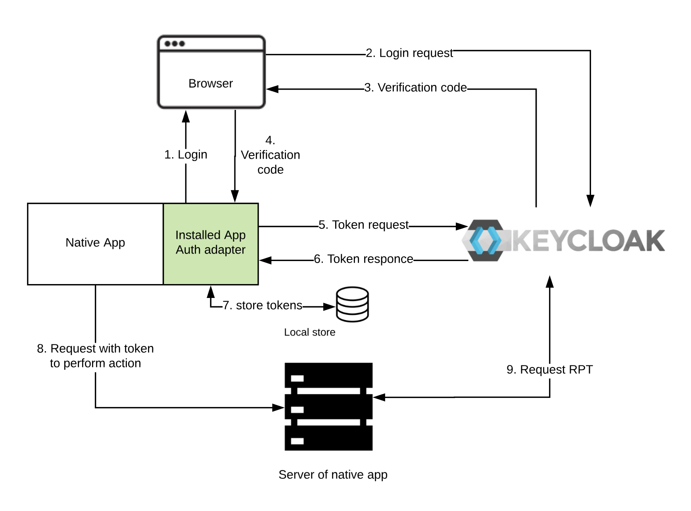

# csw-aas-http - Installed App Auth Adapter

Installed App Auth Adapter is library provided to support authentication and authorisation in native applications. It provides methods to login, getTokens, logout.
It is mainly used in Config service cli.

In order for native app to utilize installed app auth adapter, it has to be registered as keycloak client. After registering to keycloak, all client are given
 client secrets which needed for client verification. Please refer to [keycloak documentation](https://www.keycloak.org/docs/latest/getting_started/index.html) for details.

## Technology 
Keycloak comes with its own adapter for native applications. Csw InstalledAppAuthAdapter is wrapper on top of keycloak provided adapter with added support for local storage for tokens.

## Login flow 

When login method of the adapter is called, then following steps are performed.

1. It opens login page in default browser to accept the credentials of the user.
2. As the user enters credentials, it sends a request to the keycloak server.
3. For valid user credentials, keycloak returns a `Verification code` to the browser.
4. Verification code is passed back to native app.
5. Native app sends verification code and client secrets it to keycloak to get the `Access token` and `Refresh token` .
6. Keycloak verifies the client secrets and and verification code and gives back access and refresh token.
7. Adapter saves the received tokens into local store.

## Using Tokens

While sending request to server following stops are performed.  

1. Native app retrieves the access token from local store and sends it along with the request. 
2. Server verifies the token and user permissions. For this verification, server gets `RPT` (requesting party token) from keycloak which have all the information about the user roles and permissions.
User with right permissions are allowed to perform action otherwise request is rejected with appropriate response code.

# Logout flow

When logout method of the adapter is called, then following steps are performed. 

1. It removes tokens from the local store.
2. It removes the user session from keycloak.

Following diagram shows the flow of the Installed App Auth Adapter.

