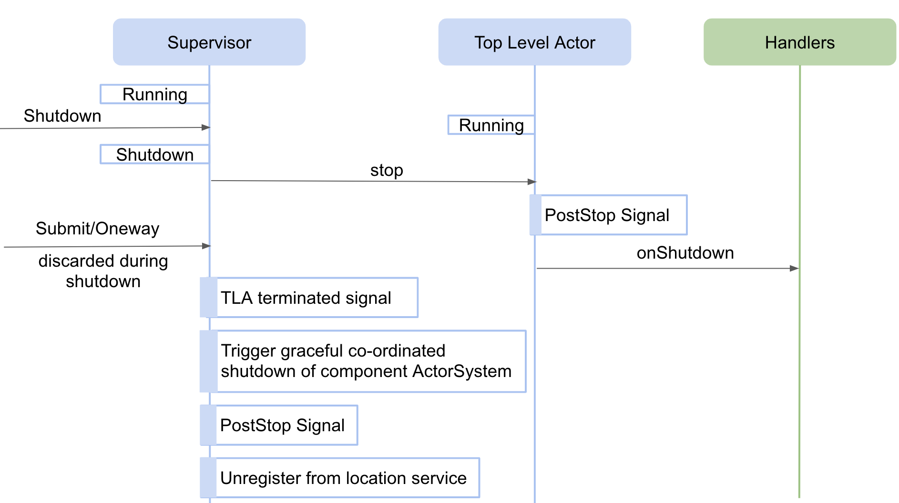
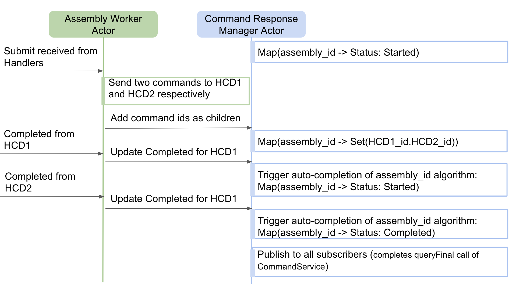

# Framework

## Introduction

The common software framework is a library that provides set of APIs used for:

- creation of components(Assemblies, HCDs) 
- discovering other components
- receiving messages from external world
- sending messages/commands to other components
- receiving responses from components
- deploying component in container or standalone mode 

The CSW framework is implemented using [Akka typed actors](https://doc.akka.io/docs/akka/current/typed/index.html).

@@@ note {title="IMPORTANT!!!"}

Actors provide a single control of execution by processing messages received one by one. If a future is spawned inside an actor then on
completion of that future, it is a common mistake to mutate actor state. It causes critical problems of state corruption because some other message
might be in process of execution and accessing the state. The ideal way to handle futures inside actors is by sending message to self on future
completion. This will make sure the mutation of state happens in order of one by one via messages. The example code can be seen 
@github[here](/csw-framework/src/main/scala/csw/framework/internal/supervisor/SupervisorBehavior.scala#L279).

@@@
  
  
## Creation of component

A component consists of couple of actors and classes created by framework on behalf of the component and some actors/classes that are expected to
be created by component writers using the csw framework.

### Framework actors/classes

The csw framework creates a @github[Supervisor](/csw-framework/src/main/scala/csw/framework/internal/supervisor/SupervisorBehavior.scala) actor as the
first thing while creating any component. The Supervisor goes on to create @github[Top Level Actor](/csw-framework/src/main/scala/csw/framework/internal/component/ComponentBehavior.scala),
@github[Pub-Sub Manager](/csw-framework/src/main/scala/csw/framework/internal/pubsub/PubSubBehavior.scala) actor and 
@github[Command Response Manager](/csw-command/csw-command-client/src/main/scala/csw/command/client/CommandResponseManagerActor.scala) actor as part of
TMT framework.

@@@ note

- The actors shown in blue are created by framework and actors/classes shown in green is expected to be written by component developer. 
- The `Handlers` shown above is implemented by extending @github[ComponentHandlers](/csw-framework/src/main/scala/csw/framework/scaladsl/ComponentHandlers.scala)/
@github[JComponentHandlers](/csw-framework/src/main/scala/csw/framework/javadsl/JComponentHandlers.scala) framework class. So, the TLA decides when to call a
specific handler method or `hooks` and implementation of `ComponentHandlers/JComponentHandlers` decides what to do when it is called, for e.g. TLA
decides when to call @github[intialize](/examples/src/main/scala/org/tmt/nfiraos/sampleassembly/SampleAssemblyHandlers.scala#L128) handler and handler
provides implementation of how to initialize a component, may be by putting the hardware in default position, etc.

@@@

To know more about the responsibility of Supervisor and Top level actor please refer this @ref:[section](../../commons/create-component.md#anatomy-of-component).

The interaction between supervisor and top level actor for creating component is shown below:

 

The code base for creation of Top level actor and watching it, from Supervisor can be found @github[here](/csw-framework/src/main/scala/csw/framework/internal/supervisor/SupervisorBehavior.scala#L301)
and code base for calling `intialize` handler from top level actor can be found @github[here](/csw-framework/src/main/scala/csw/framework/internal/component/ComponentBehavior.scala#L84).
The explanation about `Idle` state can be found @ref[here](../../commons/create-component.md#idle). 
 
@@@ note

If there is any exception thrown while executing `initialize` handler then the exception is bubbled up till Supervisor and it restarts Top level
actor which in turn calls `initialize` handler again hoping the error fixes on restart. For this, Supervisor uses restart strategy with maximum of 3
restarts possible and to be done within 5 seconds. To know more about akka supervision failure strategy please refer [Akka Fault Tolerance](https://doc.akka.io/docs/akka/current/typed/fault-tolerance.html)
document. The Supervisor code base wiring restart strategy can be found @github[here](/csw-framework/src/main/scala/csw/framework/internal/supervisor/SupervisorBehavior.scala#L309). 

@@@

Once the handler is spawned it receives `ActorContext` and @github[CswContext](/csw-framework/src/main/scala/csw/framework/models/CswContext.scala) in it's
constructor. The `ActorContext` is used to get the `ActorSystem` of the component and maybe spawn other actors i.e worker actors for maintaining state.
The `CswContext` can be used to get the handle of all the services provided by CSW. To know more about these services please refer this
@ref[section](../../commons/create-component.md#csw-services-injection).

### Configuration file for component startup

Every component needs to provide a startup config file that contains the details like name, type, handler class name, tracking details, etc.
To know more about what is it and how to write the config file please refer this @ref[section](../../framework/describing-components.md) and 
a @ref[sample file](../../commons/multiple-components.md#component-configuration-componentinfo). 

The name of the configuration file needs to be passed to @ref[Container/Standalone app](../../framework/deploying-components.md) at the time of startup.
The config file is either fetched from `Configuration Service` or taken from local path on the machine to parse it to a @github[ComponentInfo](/csw-command/csw-command-client/src/main/scala/csw/command/client/models/framework/ComponentInfo.scala)
object. The `ComponentInfo` object is then passed to `Handlers` in `CswContext`.

### ActorSystem for component

While creating a component, a new ActorSystem is spawned, which means if there are more than one components running in single jvm process there will
be more than one ActorSystems created in single jvm. Having different ActorSystems in an application is not recommended by [akka](https://doc.akka.io/docs/akka/current/general/actor-systems.html)
but it is still kept multiple per jvm so that any delay in executing a component does not affect execution of other components running in same
jvm. The code base for creating an ActorSystem for each component is written in @github[SupervisorInfoFactory](/csw-framework/src/main/scala/csw/framework/internal/supervisor/SupervisorInfoFactory.scala#L35).

## Discovering other components

For discovering other components, there are two ways:

 - provide tracking information in configuration file as explained @ref[here](../../commons/multiple-components.md#tracking-dependencies). Whenever
 there is location update of tracked components @ref[onLocationTrackingEvent](../../commons/multiple-components.md#onlocationtrackingevent-handler) handler
 is called. 

- track using @ref[trackConnection](../../commons/multiple-components.md#trackconnection) handler. 

## Receiving messages from external world

Messages aimed for component is first received by Supervisor and it decides which messages to be passed to downstream actors( i.e. Top level actor, 
Command Response manager actor or Pub-Sub manager actor)

### Restart

The code base for restart can be found @github[here](/csw-framework/src/main/scala/csw/framework/internal/supervisor/SupervisorBehavior.scala#L242).
The explanation about `Restart` state can be found @ref[here](../../commons/create-component.md#restart).

### Shutdown

The code base for shutdown can be found @github[here](/csw-framework/src/main/scala/csw/framework/internal/supervisor/SupervisorBehavior.scala#L247).
The explanation about `Shutdown` state can be found @ref[here](../../commons/create-component.md#shutdown).

### Changing log level

Messages to change log level (via `SetComponentLogLevel`) or get log metadata for a component (via `GetComponentLogMetadata`) gets handled by Supervisor.
the code base for the same can be found @github[here](/csw-framework/src/main/scala/csw/framework/internal/supervisor/SupervisorBehavior.scala#L118). 

### Lock

The code base for Lock can be found @github[here](/csw-framework/src/main/scala/csw/framework/internal/supervisor/SupervisorBehavior.scala#L205).
The explanation about `Lock` state can be found @ref[here](../../commons/create-component.md#lock).

## Sending commands

The types of commands that can be sent and it's creation can be found @ref[here](../../commons/create-component.md#receiving-commands). In order to send
commands to other components, a @github[CommandService](/csw-command/csw-command-api/src/main/scala/csw/command/api/scaladsl/CommandService.scala) helper
is needed. `CommandService` helper is used to send commands to other components, in the form of method calling instead of sending messages to bare component
supervisor actor. The creation of CommandService can be found @ref[here](../../commons/multiple-components.md#sending-commands).

The operations allowed through `CommandService` helper are as follows:

- @github[validate](/csw-command/csw-command-client/src/main/scala/csw/command/client/internal/CommandServiceImpl.scala#L38)
- @github[submit](/csw-command/csw-command-client/src/main/scala/csw/command/client/internal/CommandServiceImpl.scala#L43)
- @github[submitAll](/csw-command/csw-command-client/src/main/scala/csw/command/client/internal/CommandServiceImpl.scala#L51)
- @github[oneway](/csw-command/csw-command-client/src/main/scala/csw/command/client/internal/CommandServiceImpl.scala#L74)
- @github[onewayAndMatch](/csw-command/csw-command-client/src/main/scala/csw/command/client/internal/CommandServiceImpl.scala#L77)
- @github[query](/csw-command/csw-command-client/src/main/scala/csw/command/client/internal/CommandServiceImpl.scala#L96)
- @github[queryFinal](/csw-command/csw-command-client/src/main/scala/csw/command/client/internal/CommandServiceImpl.scala#L104)
- @github[subscribeCurrentState](/csw-command/csw-command-client/src/main/scala/csw/command/client/internal/CommandServiceImpl.scala#L107)
 
## Receiving responses from components

### Submit

To know the flow of Submit please refer this @ref[section](../../commons/command.md#the-submit-message). 

### Oneway

To know the flow of Oneway please refer this @ref[section](../../commons/command.md#the-oneway-message).
 

### Validate

To know the flow about Validate please refer this @ref[section](../../commons/command.md#the-validate-message) and the code base for the same can be
referred @github[here](/csw-framework/src/main/scala/csw/framework/internal/component/ComponentBehavior.scala#L154).

### Command Response Manager

Once a `Submit` command is received by a component for e.g. an assembly receives submit command, then the assembly can choose to send one or more
commands to HCD(s) as part of the submit command's execution. Once, all the response(s) are received from downstream HCD(s), assembly need to complete
the `Submit` as either `Completed` or `Error`. The @github[CommandResponseManager](/csw-command/csw-command-client/src/main/scala/csw/command/client/CommandResponseManagerActor.scala)
provides different mechanisms to mark `Submit` command with final state.

The Assembly worker can communicate with `CommandResponseManagerActor` using @github[CommandResponseManager](csw-command/csw-command-client/src/main/scala/csw/command/client/CommandResponseManager.scala)
coming via @github[CswContext](/csw-framework/src/main/scala/csw/framework/models/CswContext.scala#L43).

### Current State Pub/Sub

For `Oneway` commands it's responses are not sent back to sender as it is done for `Submit`. So, in order to track the status of oneway command `CurrentState` published by
receiver component should be watched. The receiver component can use @github[CurrentStatePublisher](/csw-framework/src/main/scala/csw/framework/models/CswContext.scala#L42)
to publish it's state from `CswContext` and the sender component can track state using @github[subscribeCurrentState](/csw-command/csw-command-client/src/main/scala/csw/command/client/internal/CommandServiceImpl.scala#L107)
from `CommandService`.

## Deploying component in container or standalone mode

Component(s) can start within a @ref[container](../../framework/deploying-components.md#container-for-deployment) or a single component can start as a
@ref[standalone](../../framework/deploying-components.md#standalone-components). The code base for @github[Container](/csw-framework/src/main/scala/csw/framework/internal/container/ContainerBehavior.scala) 
and @github[Standalone](/csw-framework/src/main/scala/csw/framework/internal/wiring/Standalone.scala). 

Since Akka Typed is used throughout the TMT framework, there are seperate messages understood by Container, Supervisor, Top level actor and other actors
of framework. The architecture/relations of messages can be found @github[here](/csw-command/csw-command-client/src/main/scala/csw/command/client/messages/MessagesArchitecture.scala). 

